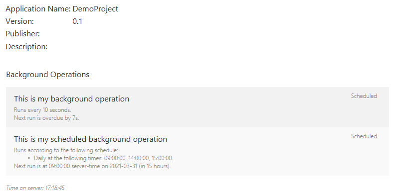
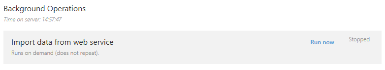
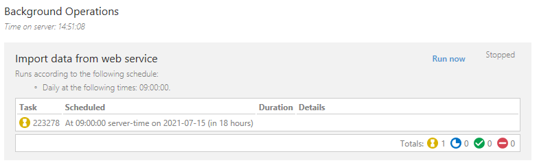
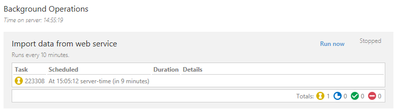

# M-Files Vault Application Framework Extensions (Community)

Please drill into the sub-folders for details on available objects/methods and their use.

## ConfigurableVaultApplicationBase<T>

This base class should be used for vault applications that use the VAF Extensions library.  This base class implements various functionality such as generating dashboards for your task processors and background operations, and implementing the [logging framework](https://development.m-files.com/Frameworks/Logging/):



### Controlling configuration upgrades

When using the `ConfigurableVaultApplicationBase<T>` class, changes to the structure of the configuration type (T) provided can cause issues with your application starting.  For example: if a class previously defines a property as a string but is changed to be an integer, the deserialization of any held configuration will fail and the application will not start.

This library supports the ability for you to [programmatically control the upgrade process](Configuration/Upgrading) so that the application can convert any old configuration across to the new structures and continue loading.  More information is available in the [dedicated readme page](Configuration/Upgrading/Readme.md).

### Using the TaskQueueBackgroundOperationManager

The [TaskQueueBackgroundOperationManager](TaskQueueBackgroundOperations/TaskQueueBackgroundOperationManager) is a drop-in replacement for the old `BackgroundOperationManager` from previous VAF releases.  This updated manager is fully compatible with [M-Files Multi-Server Mode](https://developer.m-files.com/Frameworks/Vault-Application-Framework/Multi-Server-Mode/) by utilising task queues behind the scenes.  The manager allows creation of both [background operations that recur on an interval](TaskQueueBackgroundOperations/TaskQueueBackgroundOperationManager#creating-a-recurring-background-operation) and also [background operations that run on a more complex schedule](TaskQueueBackgroundOperations/TaskQueueBackgroundOperationManager#creating-a-background-operation-that-runs-on-a-schedule).

*The `TaskQueueBackgroundOperationManager` approach should only be used for migrating from old-style background operations; it is recommended that new development uses the attribute-based declarative approach detailed below.*

### Using VAF 2.3 task processors

Read more about VAF 2.3 task processors here: [https://developer.m-files.com/Frameworks/Vault-Application-Framework/Task-Queues/](https://developer.m-files.com/Frameworks/Vault-Application-Framework/Task-Queues/).

Standard VAF task queues are automatically exposed on the above dashboard, but can be customised by adding a `[ShowOnDashboard]` attribute.  In the example below the `ShowRunCommand` property is set to `true`, adding a button to the dashboard allowing the task to be run ad-hoc.



```csharp
namespace sampleApplication
{
	public class VaultApplication
		: MFiles.VAF.Extensions.ConfigurableVaultApplicationBase<Configuration>
	{

		[TaskQueue]
		public const string QueueId = "sampleApplication.VaultApplication";
		public const string ImportDataFromRemoteSystemTaskType = "ImportDataFromRemoteSystem";

		[TaskProcessor(QueueId, ImportDataFromRemoteSystemTaskType)]
		[ShowOnDashboard("Import data from web service", ShowRunCommand = true)]
		public void ImportDataFromRemoteSystem(ITaskProcessingJob<TaskDirective> job)
		{
			// TODO: Connect to the remote system and import data.
		}
	}
}
```

#### Hiding queues or task processors

If you would like to hide a specific task processor (or an entire queue), then add a `[HideOnDashboard]` attribute:

```csharp
namespace sampleApplication
{
	public class VaultApplication
		: MFiles.VAF.Extensions.ConfigurableVaultApplicationBase<Configuration>
	{

		[TaskQueue]
		[HideOnDashboard] // Hide this queue entirely (all processors).
		public const string QueueId = "sampleApplication.VaultApplication";
		public const string ImportDataFromRemoteSystemTaskType = "ImportDataFromRemoteSystem";

		[TaskProcessor(QueueId, ImportDataFromRemoteSystemTaskType)]
		public void ImportDataFromRemoteSystem(ITaskProcessingJob<TaskDirective> job)
		{
			// TODO: Connect to the remote system and import data.
		}
	}
}
```

```csharp
namespace sampleApplication
{
	public class VaultApplication
		: MFiles.VAF.Extensions.ConfigurableVaultApplicationBase<Configuration>
	{

		[TaskQueue]
		public const string QueueId = "sampleApplication.VaultApplication";
		public const string ImportDataFromRemoteSystemTaskType = "ImportDataFromRemoteSystem";
		public const string ImportDataFromRemoteSystemTaskType2 = "ImportDataFromRemoteSystem2";

		[TaskProcessor(QueueId, ImportDataFromRemoteSystemTaskType)]
		[HideOnDashboard] // Hide just this processor.
		public void ImportDataFromRemoteSystem(ITaskProcessingJob<TaskDirective> job)
		{
			// TODO: Connect to the remote system and import data.
		}

		// This processor would still be shown.
		[TaskProcessor(QueueId, ImportDataFromRemoteSystemTaskType2)]
		public void ImportDataFromRemoteSystem2(ITaskProcessingJob<TaskDirective> job)
		{
			// TODO: Connect to the remote system and import data.
		}
	}
}
```

#### Automatically running task processors

Sometimes task processors should automatically be run, either on an interval (e.g. "every 10 minutes"), or on a more complex schedule (e.g. "every Saturday at 9am").  Configuration of these can be done by decorating configuration items with additional attributes:

##### On a schedule



```csharp
namespace sampleApplication
{
	public class VaultApplication
		: MFiles.VAF.Extensions.ConfigurableVaultApplicationBase<Configuration>
	{

		[TaskQueue]
		public const string QueueId = "sampleApplication.VaultApplication";
		public const string ImportDataFromRemoteSystemTaskType = "ImportDataFromRemoteSystem";

		[TaskProcessor(QueueId, ImportDataFromRemoteSystemTaskType)]
		[ShowOnDashboard("Import data from web service", ShowRunCommand = true)]
		public void ImportDataFromRemoteSystem(ITaskProcessingJob<TaskDirective> job)
		{
			// TODO: Connect to the remote system and import data.
		}
	}
	[DataContract]
	public class Configuration
	{
		// The import will run daily at 9am but can be configured via the M-Files Admin software.
		[DataMember]
		[RecurringOperationConfiguration(VaultApplication.QueueId, VaultApplication.ImportDataFromRemoteSystemTaskType)]
		public Schedule ImportDataSchedule { get; set; } = new Schedule()
		{
			Enabled = true,
			Triggers = new List<Trigger>()
			{
				new DailyTrigger()
				{
					TriggerTimes = new List<TimeSpan>()
					{
						new TimeSpan(9, 0, 0) // 9am
					}
				}
			}
		};
	}
}
```

##### After a time interval



Note: tasks set to run on an interval will automatically be scheduled to run when the vault starts, then to recur after the set interval.  To change this behaviour see [suppressing an interval-based task from running at vault startup](suppressing-an-interval-based-task-from-running-at-vault-startup).

```csharp
namespace sampleApplication
{
	public class VaultApplication
		: MFiles.VAF.Extensions.ConfigurableVaultApplicationBase<Configuration>
	{

		[TaskQueue]
		public const string QueueId = "sampleApplication.VaultApplication";
		public const string ImportDataFromRemoteSystemTaskType = "ImportDataFromRemoteSystem";

		[TaskProcessor(QueueId, ImportDataFromRemoteSystemTaskType)]
		[ShowOnDashboard("Import data from web service", ShowRunCommand = true)]
		public void ImportDataFromRemoteSystem(ITaskProcessingJob<TaskDirective> job)
		{
			// TODO: Connect to the remote system and import data.
		}
	}
	[DataContract]
	public class Configuration
	{
		// The import will run every 10 minutes but can be changed to another interval via the M-Files Admin software.
		[DataMember]
		[RecurringOperationConfiguration
		(
			VaultApplication.QueueId,
			VaultApplication.ImportDataFromRemoteSystemTaskType,
			TypeEditor = "time"
		)]
		public TimeSpan Interval { get; set; } = new TimeSpan(0, 10, 0);
	}
}
```

###### Suppressing an interval-based task from running at vault startup

Declaring the property or field type as `TimeSpanEx` will allow the user to confirm whether the task should or should not run when the vault starts.  By default this value is true (run at vault startup, then after a time period).

```csharp
namespace sampleApplication
{
	public class VaultApplication
		: MFiles.VAF.Extensions.ConfigurableVaultApplicationBase<Configuration>
	{

		[TaskQueue]
		public const string QueueId = "sampleApplication.VaultApplication";
		public const string ImportDataFromRemoteSystemTaskType = "ImportDataFromRemoteSystem";

		[TaskProcessor(QueueId, ImportDataFromRemoteSystemTaskType)]
		[ShowOnDashboard("Import data from web service", ShowRunCommand = true)]
		public void ImportDataFromRemoteSystem(ITaskProcessingJob<TaskDirective> job)
		{
			// TODO: Connect to the remote system and import data.
		}
	}
	[DataContract]
	public class Configuration
	{
		// The import will run every 10 minutes but can be changed to another interval via the M-Files Admin software.
		[DataMember]
		[RecurringOperationConfiguration
		(
			VaultApplication.QueueId,
			VaultApplication.ImportDataFromRemoteSystemTaskType
		)]
		public TimeSpanEx Interval { get; set; } = new TimeSpanEx()
		{
			Interval = new TimeSpan(0, 10, 0),
			// This one does not run at startup, although the user can change this in the admin configuration.
			RunOnVaultStartup = false
		};
	}
}
```

##### Allowing the administrator to change between an interval and a schedule

```csharp
namespace sampleApplication
{
	public class VaultApplication
		: MFiles.VAF.Extensions.ConfigurableVaultApplicationBase<Configuration>
	{

		[TaskQueue]
		public const string QueueId = "sampleApplication.VaultApplication";
		public const string ImportDataFromRemoteSystemTaskType = "ImportDataFromRemoteSystem";

		[TaskProcessor(QueueId, ImportDataFromRemoteSystemTaskType)]
		[ShowOnDashboard("Import data from web service", ShowRunCommand = true)]
		public void ImportDataFromRemoteSystem(ITaskProcessingJob<TaskDirective> job)
		{
			// TODO: Connect to the remote system and import data.
		}
	}
	[DataContract]
	public class Configuration
	{
		// The import will run every 10 minutes but can be changed to another interval, or another schedule, by the administrator.
		// For example: the configuration could be altered to instead only run once a day at 4am.
		[DataMember]
		[RecurringOperationConfiguration(VaultApplication.QueueId, VaultApplication.ImportDataFromRemoteSystemTaskType)]
		public Frequency Schedule { get; set; } = new TimeSpan(0, 10, 0);
	}
}
```

##### Implementing IRecurrenceConfiguration

The `RecurringOperationConfiguration` attribute can be used with any property or field whose type implements `IRecurrenceConfiguration` (plus `TimeSpan`, but that's a special case).  If you want to create your own logic then you can create a class that implements this interface and use it in your configuration:

```csharp
[DataContract]
public class RandomRecurrenceConfiguration
	: IRecurrenceConfiguration
{
	private static Random rnd = new Random();

	[DataMember]
	[JsonConfIntegerEditor(Min = 5, Max = 1000)]
	public int MinimumMinutes { get;set; } = 5;
	
	[DataMember]
	[JsonConfIntegerEditor(Min = 5, Max = 1000)]
	public int MaximumMinutes { get;set; } = 200;
	
	[DataMember]
	public bool RunOnVaultStartup { get; } = false;
	
	/// <inheritdoc />
	public string ToDashboardDisplayString()
	{
		return $"<p>Runs randomly between {this.MinimumMinutes} and {this.MaximumMinutes} minutes after the last run time.</p>";
	}

	/// <inheritdoc />
	public DateTime? GetNextExecution(DateTime? after = null)
	{
		// Create a random interval.
		var interval = TimeSpan.FromMinutes(rnd.Next(this.MinimumMinutes, this.MaximumMinutes));

		// Return the next-run time.
		return (after ?? DateTime.UtcNow).Add(interval);
	}
}

// Use the custom logic.
[DataContract]
public class Configuration
{
	[DataMember]
	[RecurringOperationConfiguration
	(
		VaultApplication.QueueId,
		VaultApplication.UploadToRemoteSystemTaskType,
		DefaultValue = "Runs randomly throughout the day"
	)]
	public RandomRecurrenceConfiguration TaskOneSchedule { get; set; } = new RandomRecurrenceConfiguration();
}
```

## Logging

The VAF Extensions library also implements the boilerplate code required to integrate the [M-Files Vault Application Logging Framework](https://developer.m-files.com/Frameworks/Logging/) into your VAF applications.  For this to work your vault application class **must** inherit from `MFiles.VAF.Extensions.ConfigurableVaultApplicationBase<T>`.  Your configuration class must also either inherit from `MFiles.VAF.Extensions.Configuration.ConfigurationBase`, or must implement `MFiles.VAF.Extensions.Configuration.IConfigurationWithLoggingConfiguration`.

To use logging from within your vault application class, simply log using the logger instance:

```
using MFiles.VAF.Extensions.Dashboards;
using MFiles.VAF.Configuration.Logging;
namespace LoggingExample
{
	public class VaultApplication
		: MFiles.VAF.Extensions.ConfigurableVaultApplicationBase<Configuration>
	{
 
		[TaskQueue]
		public const string QueueId = "test.VaultApplication.myQueueId";
		public const string TaskTypeA = "taskTypeA";
 
		[TaskProcessor(QueueId, TaskTypeA, TransactionMode = TransactionMode.Full)]
		[ShowOnDashboard("Import data", ShowRunCommand = true)]
		public void ProcessBackgroundTask(ITaskProcessingJob<TaskDirective> job)
		{
			// Log "hello world" to appropriate targets
			this.Logger?.Info("hello world");
		}
 
	}
}
```

Where you need to log from other classes, create your own logger instance.  Each class should have its own logger.

```
using MFiles.VAF.Configuration.Logging;
namespace LoggingExample
{
	public class DocumentProcessor
	{
		private ILogger Logger { get; }
		public DocumentProcessor()
		{
			// Instantiate the logger.
			this.Logger = LogManager.GetLogger(this.GetType());
		}

		public void ProcessDocument(ObjVerEx o)
		{
			// Note the syntax for compatibility with log sensitivity filters.
			this.Logger?.Trace($"Starting processing {o}");

			try
			{
				// TODO: Implement.
			}
			catch(Exception e)
			{
				// Also log the exceptions.
				this.Logger?.Error(e, $"Exception processing {o}.");
			}
		}
 
	}
}
```

## Dashboards

The VAF Extensions library contains some default functionality to create basic [VAF dashboards](https://developer.m-files.com/Frameworks/Vault-Application-Framework/Configuration/Custom-Dashboards/) showing information about your application, any asynchronous operations that are defined, and logging configuration.  Version 22.4 of the extensions library brings some breaking changes aimed to improve the extensibility of this concept.

### Breaking changes in VAF Extensions 22.4

#### Approach

If you wanted to customise the dashboard in previous versions of the VAF Extensions (e.g. to create your own section of content) the you needed to override `GetDashboardContent`.  The primary issue with this was that, if you wanted to include any of the standard content, you had to build the status dashboard in a specific way to ensure that the refresh functionality and the like still worked.  VAF Extensions 22.4 changes the approach needed to allow you more control.

**IT IS STRONGLY RECOMMENDED THAT YOU DO NOT OVERRIDE `GetDashboardContent` ANY MORE**

Instead, you can choose to override `GetStatusDashboardRootItems`.  This method returns the dashboard content that should be placed into the status dashboard, in the order it should be shown.  By default it will return:

1. The application overview (name, version, etc.) details from the underlying VAF implementation (provided by `GetApplicationOverviewDashboardControl`), then
2. Details on any asynchronous operations that are defined in this application (provided by `GetAsynchronousOperationDashboardControl`), then
3. Details on logging configuration (provided by `GetLoggingDashboardControl`).

To add an existing item to the end of the dashboard, you could do this:

```csharp
public override IEnumerable<IDashboardContent> GetStatusDashboardRootItems(IConfigurationRequestContext context)
{
	// Include everything we would by default.
	foreach(var c in base.GetStatusDashboardRootItems(context) ?? Enumerable.Empty<IDashboardContent>())
		yield return c;

	// Add some more content to the bottom.
	yield return this.GenerateCustomDashboardContent(context); // Not shown, but imagine it does something awesome.
}
```

To change the way in which details about your application are shown, but to keep everything else, you could override `GetApplicationOverviewDashboardContent`:

```csharp
public override IDashboardContent GetApplicationOverviewDashboardContent(IConfigurationRequestContext context)
{
	// This replaces the table that includes the application name, version, etc.
	return new DashboardCustomContent("hello world!");
}
```
Note that all of the other dashboard content is still included in the order it would be normally.

You could even remove a standard section by overriding the appropriate method and returning null:

```csharp
public override IDashboardContent GetApplicationOverviewDashboardContent(IConfigurationRequestContext context)
{
    // This would cause the application overview section to be omitted, but the rest of the dashboard rendered as normal.
    return null;
}
```

#### Method signatures

The dashboard-generation methods now get provided with the configuration request context, so a method with a signature of `IDashboardContent GetAsynchronousOperationDashboardContent()` has changed to `IDashboardContent GetAsynchronousOperationDashboardContent(IConfigurationRequestContext context)`.  If you are overriding these methods then alter the method signature to the new one.